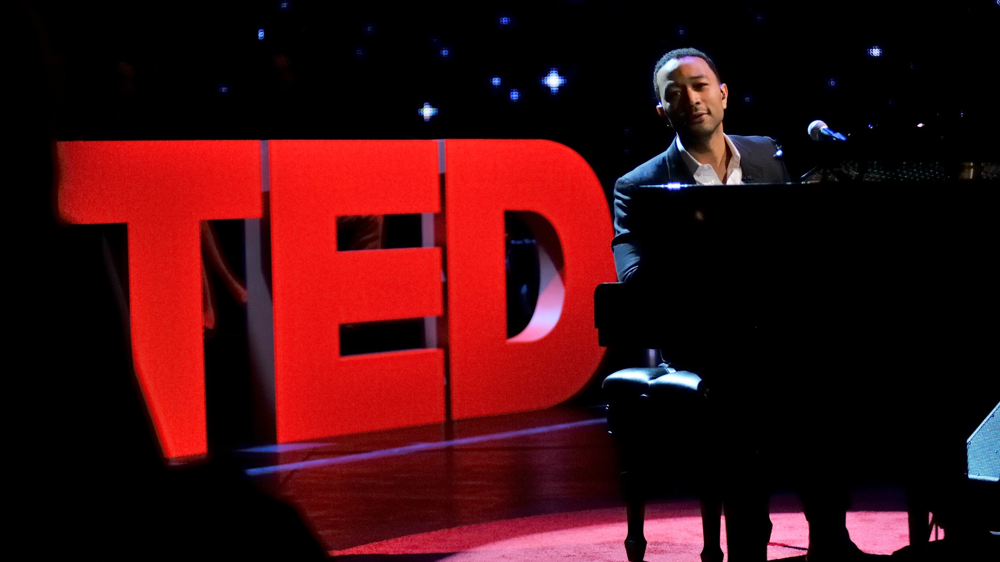

# Need a Title for your TED Talk?

### Daniel Kim  

### Pop Quiz: Which of the following are titles from *actual* TED Talks?
*scroll to bottom of page for answers*

 1. This gel can make you stop bleeding instantly
 2. Soon we'll cure diseases with a cell, not a pill
 3. Two nameless bodies washed up on the beach. Here are their stories.
 4. Inside America's dead shopping malls
 5. “Am I dying?” The honest answer.
 6. An Iraq war movie crowd-sourced from soldiers
 7. Why is "you're a fighter" the wrong thing to say to someone in trauma?
 8. A thought experiment on the intelligence of crows
 9. The deadly genius of drug cartels
 10. My DNA vending machine  

  

## Overview
This project's genesis provided inroads to better understand generative models, and in particular, text generation. Although fickle may be one way to describe the project, I believe it's quite the opposite. Use cases are diverse and plentiful for text generation. This instantiation simply shows the power of generation as an aid to productivity for those who could use an assistant to help derive creative ideas: coming up with non-trivial restaurant or business names, assistance for educators looking for assignment ideas, researchers who could benefit from creative, unexplored papers within their domain expertise. Even professional poets have used text generation to analyze its benefit for writing assistance.

It's important to note that at the crux of these generative ideas is originality--originality derived from a machine, but no less unique. For example, take the list of TED titles above, google them, and you'll find they don't return search results--because they don't yet exist.

This is powerful AI, indeed. The model behind this particular implementation is called GPT-2, and in recent months, the center of debate among many data scientists and AI practitioners. Most of the discourse is located at the model's ethical concerns. When OpenAI first released its model, it did so controversially by demonstrating how text generation could write a news article nearly indistinguishable from the real thing. With the proliferation of fake news already in circulation within pop culture, critics worried that GPT-2 could usher in an unprecedented wave of expertly crafted fake news and potentially deceiving millions. The AI and deep learning community took this threat seriously enough that the AllenAI Institute recently released a model called Grover (yet another model with a Sesame Street namesake--will it ever stop?) to combat fake news algorithms by detecting and uncovering fake news generated by such models.

## Purpose
While I am not trying to recover OpenAI's efforts or weigh in on the debate, my point simply is to provide alternative uses to text generation. The technology will be around regardless of how the ethical battle ensues, and I'd like to point out its utility within positive use cases.

## Analysis
From start to finish, this project took me nearly a month to complete, inclusive of training, fine-tuning, running inference, and all the starts and stops of using datasets that simply did not cooperate with the model.

The project began with my attempt to train a dataset of complete transcripts of TED Talks as a way of providing a kind of proof of concept that such endeavors are possible. However, the task was not an easy one, and the model, while impressive, failed to construct enough coherence to construct what may appear as a reasonable TED Talk.

One of the primary problems was GPT-2's tendency toward repetition the longer the sentences it tried to construct. Options for fine-tuning hyperparameters are available, time-consuming, and often times, problematic. Essentially, the model's major handle is what they call GPT's "temperature" parameter. The lower the temperature, the closer GPT stays on task but at the cost of high repetition. At the other extreme, a higher temperature creates more original (some might call this increased creativity) text at the expense of occasionally chaotic, non-coherent generation.  

My next foray was to take a dataset of titles from machine learning papers to potentially derive creative ideas for researchers. Here, I found more success. Real-sounding sample paper titles began to emerge during training (sample output is a feature of GPT-2 training):  

- anomaly detection with deep neural networks  
- methodology for augmented bayesian networks  
- annotations of corpora with context specific words and words  

As well as the non-sensical (and on occasion, poetic):  
- convex recursive optimization on the possibility of being  
- flexible temps des moments du temps  
- complexity optimization for universal linear stochastic optimization  
- the effect of call comment on fool's labelling  
- co-evolution of skip-gram and weighted-only regression algorithms for finite-state tensor completion  

You can see from the above GPT-2's proclivity for repetition in two of the titles.

For the above, I applied Fast.ai's library to the model in an effort to speed up training times and to familiarize myself with both fast.ai's features. The results were similar to what I'd expected. Fast.ai minimally reduced training time, but it did require less code and showcased a fast and powerful tool to simplify model parameter tuning and general setup.

Finally, after a mostly-successful run with the academic titles dataset, I returned to the TED dataset and decided instead to train just the titles. These results proved to be the best. Convergence to 0.01 took only several hundred iterations, and as painful as it was to recognize--this portion of the project could have saved me weeks of training time.  

## Results
Still, the results proved far better than my previous two attempts. Although not a Turing Test, per se, initial responses from friends and colleagues demonstrated an abysmal failure to identify which titles were real and which ones were original text generations. Even as I sorted the real from the fake in order to run the demo, I consistently forgot which ones were which and had to constantly refer back to my notes to determine the correct answers.  

I hope you fared better on my quiz than I did!

> Quiz Answers:
Numbers 6 and 8 are real titles.
The rest is original generative text!  

#### Credits  
 - Header photo courtesy PBS
